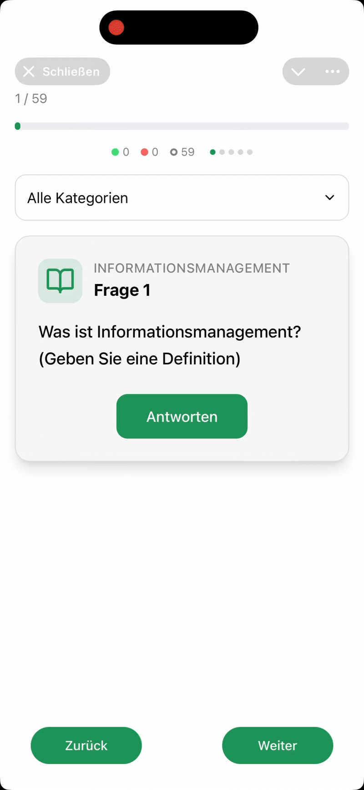

# Telegram learning cards

An interactive study tool built as a Telegram WebApp.  
It uses flashcard-style questions to help users review topics like **Information Management**, **Project Management**, and more.

<p align="center">
  
</p>

---

## 🚀 Features

- ✅ Flashcard-style quiz interface
- 📂 Category filtering (e.g. Information Management, Project Management)
- 🧠 Multiple question types:
  - Text input
  - Multiple choice
  - True/False
  - Checkboxes
  - Ordering
  - Fill-in-the-blanks
- 🎉 Progress tracking and final score
- 🔄 Answer retry and instant feedback
- 🎨 Adapts to Telegram’s light/dark theme
- 📱 Optimized for mobile + virtual keyboard
- 🤖 Telegram WebApp integration (TWA SDK v8+)
  - Fullscreen support
  - Main/Back button handling
  - Haptic feedback
  - Data submission via `sendData`

---

## 📦 Tech Stack

- **React** (w/ hooks)
- **TypeScript**
- **Tailwind CSS** (for responsive styling)
- **Telegram WebApp SDK**
- Local state management (no external store)
- Fully client-side (no backend required)

---

## 🛠️ Setup Instructions

```bash
# 1. Clone the repository
git clone https://github.com/your-username/twa-quiz-cards.git

# 2. Navigate into the project
cd twa-quiz-cards

# 3. Install dependencies
npm install

# 4. Start the development server
npm run dev
